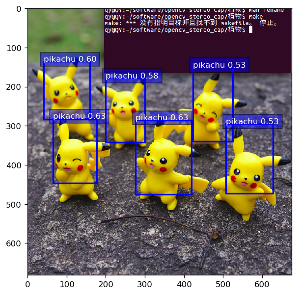
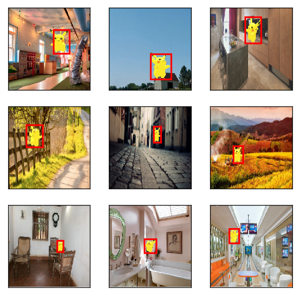

```python
from mxnet import gluon
import mxnet as mx_net
import os
import numpy as np 
from mxnet import image
from mxnet import nd
from mxnet import init
from mxnet import cpu
import matplotlib as _plotlib
import matplotlib.pyplot as _pyplot
from mxnet.contrib.ndarray import MultiBoxPrior
from mxnet.gluon import nn
from mxnet.contrib.ndarray import MultiBoxDetection
ctx = mx_net.cpu()
mean_rgb_value = nd.array([123, 117, 104])
NumOfClass=1
NamesOfClass = ['pikachu'] #类名称
shape_dataset = 256

%matplotlib inline
_plotlib.rcParams['figure.dpi']= 120

def RectBox(Box_Rectangle, color, linewidth=3):
    """convert an anchor Box_Rectangle to a matplotlib rectangle"""
    Box_Rectangle = Box_Rectangle.asnumpy()
    return _pyplot.Rectangle(
        (Box_Rectangle[0], Box_Rectangle[1]), Box_Rectangle[2]-Box_Rectangle[0], Box_Rectangle[3]-Box_Rectangle[1],
        fill=False, edgecolor=color, linewidth=linewidth)

#预测物体的类别
def ClassPredictor(Anchors_Numbers, Classes_Numbers):
    """return a layer to predict classes"""
    return nn.Conv2D(Anchors_Numbers * (Classes_Numbers + 1), 3, padding=1)

#预测物体的边框
def YucheBox(Anchors_Numbers):
    """return a layer to predict delta locations"""
    return nn.Conv2D(Anchors_Numbers * 4, 3, padding=1)

#减半模块
def Reduce_Module(out_lays):
    """stack two Conv-BatchNorm-Relu blocks and then a pooling layer
    to halve the feature size"""
    outputs = nn.HybridSequential()
    for _ in range(2):
        outputs.add(nn.Conv2D(out_lays, 3, strides=1, padding=1))#输出　num_filters　个通道数
        outputs.add(nn.BatchNorm(in_channels=out_lays))#归一化
        outputs.add(nn.Activation('relu'))
    outputs.add(nn.MaxPool2D(2)) 
    return outputs

#将不同层的输出合并
def Fla_yuche(pred):
    return pred.transpose(axes=(0,2,3,1)).flatten()

def link_yuche(preds):
    return nd.concat(*preds, dim=1)

#主体网络
def main_body_net():
    outputs = nn.HybridSequential()
    for range_prediction in [16, 32, 64]:
        outputs.add(Reduce_Module(range_prediction))
    return outputs

#定义ssd模型
def SSD_Model(Anchors_Numbers, Classes_Numbers):
    ReduceSamplers = nn.Sequential()
    for _ in range(3):
        ReduceSamplers.add(Reduce_Module(128))
        
    ClassPred = nn.Sequential()
    Box_Pred = nn.Sequential()    
    for _ in range(5):
        ClassPred.add(ClassPredictor(Anchors_Numbers, Classes_Numbers))
        Box_Pred.add(YucheBox(Anchors_Numbers))

    All_Models = nn.Sequential()
    All_Models.add(main_body_net(), ReduceSamplers, ClassPred, Box_Pred)
    return All_Models

#计算预测

def SsdModelForward(x, All_Models, sizes, ratios, verbose=False):    
    main_body_net, ReduceSamplers, ClassPred, Box_Pred = All_Models
    output_anchors, output_class_preds, output_box_preds = [], [], []
    # feature extraction    
    x = main_body_net(x)#feature extraction完毕
    for i in range(5):
        # predict
        output_anchors.append(MultiBoxPrior(
            x, sizes=sizes[i], ratios=ratios[i]))
        output_class_preds.append(
            Fla_yuche(ClassPred[i](x)))
        output_box_preds.append(
            Fla_yuche(Box_Pred[i](x)))
        if verbose:
            print('Predict scale', i, x.shape, 'with', 
                  output_anchors[-1].shape[1], 'output_anchors')
        # down sample
        if i < 3:
            x = ReduceSamplers[i](x)
        elif i == 3:
            x = nd.Pooling(
                x, global_pool=True, pool_type='max', 
                kernel=(x.shape[2], x.shape[3]))
    # concat data
    return (link_yuche(output_anchors),
            link_yuche(output_class_preds),
            link_yuche(output_box_preds))

#完整的模型

class ToySSD(gluon.Block):
    def __init__(self, Classes_Numbers, verbose=False, **kwargs):
        super(ToySSD, self).__init__(**kwargs)
        # anchor Box_Rectangle sizes and ratios for 5 feature scales
        self.sizes = [[.2,.272], [.37,.447], [.54,.619], 
                      [.71,.79], [.88,.961]]
        self.ratios = [[1,2,.5]]*5
        self.Classes_Numbers = Classes_Numbers
        self.verbose = verbose
        Anchors_Numbers = len(self.sizes[0]) + len(self.ratios[0]) - 1
        # use name_scope to guard the names
        with self.name_scope():
            self.All_Models = SSD_Model(Anchors_Numbers, Classes_Numbers)

    def forward(self, x):
        output_anchors, output_class_preds, output_box_preds = SsdModelForward(
            x, self.All_Models, self.sizes, self.ratios, 
            verbose=self.verbose)
        # it is better to have class predictions reshaped for softmax computation       
        output_class_preds = output_class_preds.reshape(shape=(0, -1, self.Classes_Numbers+1))
        return output_anchors, output_class_preds, output_box_preds
    
#预测初始化
os.makedirs('checkpoints',exist_ok=True)
filename = "checkpoints/testnet.params"
filename_2 = "checkpoints_2/ssd_net.params"
filename_3 = "checkpoints_3/ssd_net_3.params"
ctx = cpu(0)
#TrainData.reshape(label_shape=(3, 5))
#TrainData = TestData.sync_label_shape(TrainData)
net = ToySSD(NumOfClass)
net.load_params(filename_3, ctx=ctx)

#图像预处理
def img_Processor(file_name):
    with open(file_name, 'rb') as f:
        img = image.imdecode(f.read())
    # resize to shape_dataset
    data = image.imresize(img, shape_dataset, shape_dataset)
    # minus rgb mean
    data = data.astype('float32') - mean_rgb_value
    # convert to batch_test x channel x height xwidth
    return data.transpose((2,0,1)).expand_dims(axis=0), img

#定义预测函数
def predict(x):
    output_anchors, output_class_preds, output_box_preds = net(x.as_in_context(ctx))
    output_class_probs = nd.SoftmaxActivation(
        output_class_preds.transpose((0,2,1)), mode='channel')

    return MultiBoxDetection(output_class_probs, output_box_preds, output_anchors,force_suppress=True, clip=False)

#预测
path='../img/pikachu6_2.png'
path_2='../img/pikachu6.jpg'#经过旋转后的识别效果不如上图的好
path_3='../img/pikachu2.jpg'
x, img = img_Processor(path)
outputs = predict(x)
outputs.shape
print(outputs[0][0:20])

#显示输出
five_colors = ['blue', 'green', 'red', 'black', 'magenta']
_plotlib.rcParams['figure.figsize'] = (6,6)

def display_preds(img, outputs, threshold=0.5):    
    _pyplot.imshow(img.asnumpy())
    for rows in outputs:
        rows = rows.asnumpy()
        class_num_id, class_score = int(rows[0]), rows[1]
        if class_num_id < 0 or class_score < threshold:
            continue
        color = five_colors[class_num_id%len(five_colors)]#例如０％５＝０　１％５＝１　２％５＝２
        Box_Rectangle = rows[2:6] * np.array([img.shape[0],img.shape[1]]*2)
        rect = RectBox(nd.array(Box_Rectangle), color, 2)
        _pyplot.gca().add_patch(rect)
                        
        text = NamesOfClass[class_num_id]
        _pyplot.gca().text(Box_Rectangle[0], Box_Rectangle[1], 
                       '{:s} {:.2f}'.format(text, class_score),
                       bbox=dict(facecolor=color, alpha=0.5),
                       fontsize=10, color='white')
    _pyplot.show()

display_preds(img, outputs[0], threshold=0.51)

```

    
    [[ 0.          0.6337336   0.09517132  0.4164515   0.25929707  0.6608266 ]
     [ 0.          0.6276029   0.40521938  0.42220128  0.6140433   0.7022898 ]
     [-1.          0.60243845  0.09184695  0.43256217  0.30487546  0.704781  ]
     [ 0.          0.598556    0.06077033  0.20080139  0.23408502  0.41945302]
     [ 0.          0.5817347   0.2931554   0.2630278   0.43930414  0.5056321 ]
     [-1.          0.53474945  0.11063086  0.4262441   0.2776322   0.6868514 ]
     [ 0.          0.5346367   0.6199095   0.22232957  0.76834416  0.50345594]
     [ 0.          0.53002626  0.7436758   0.43619734  0.9199196   0.70006055]
     [-1.          0.5282933   0.7468314   0.47016847  0.90971005  0.7037443 ]
     [-1.          0.5111046   0.6109292   0.23628788  0.778186    0.46864676]
     [ 0.          0.5040759   0.22642899  0.39759594  0.59670854  0.748411  ]
     [-1.          0.49479467  0.10122155  0.42209634  0.2542601   0.6448207 ]
     [-1.          0.49127272  0.09505249  0.41199532  0.26007748  0.6454318 ]
     [-1.          0.48981056  0.07060494  0.39219394  0.27663994  0.68533444]
     [-1.          0.4867261   0.0840655   0.4175213   0.26106033  0.64935094]
     [-1.          0.47976097  0.41955972  0.4152529   0.5884317   0.626729  ]
     [ 0.          0.4782959   0.17801517  0.44807756  0.335068    0.64544165]
     [ 0.          0.47698796  0.40156436  0.24246253  0.6601237   0.6776883 ]
     [-1.          0.47683707  0.4190115   0.3933307   0.61554396  0.651145  ]
     [-1.          0.47642374  0.7593402   0.46533474  0.9108097   0.70405114]]
    <NDArray 20x6 @cpu(0)>





```python

```




